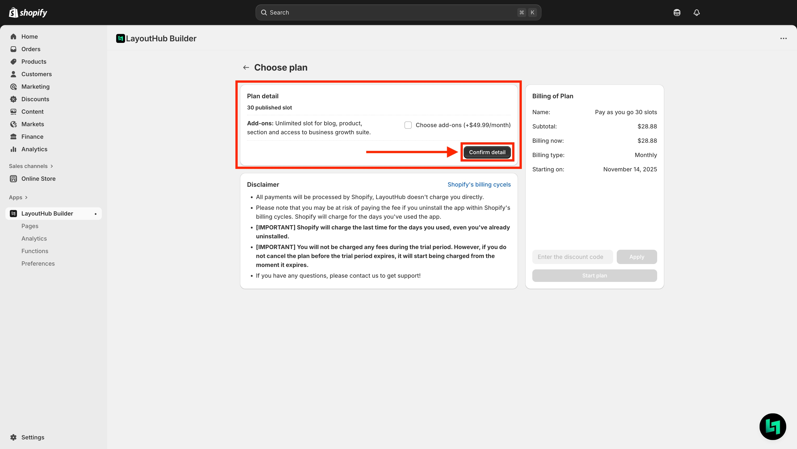
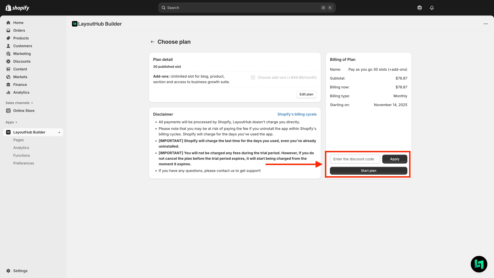
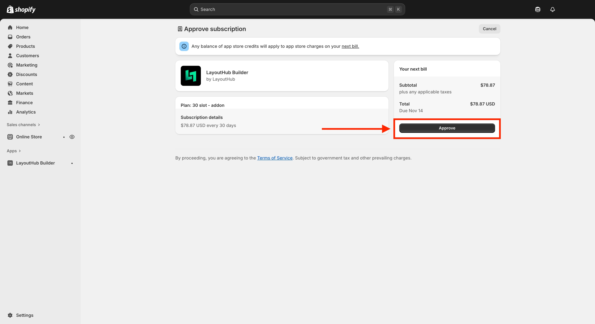
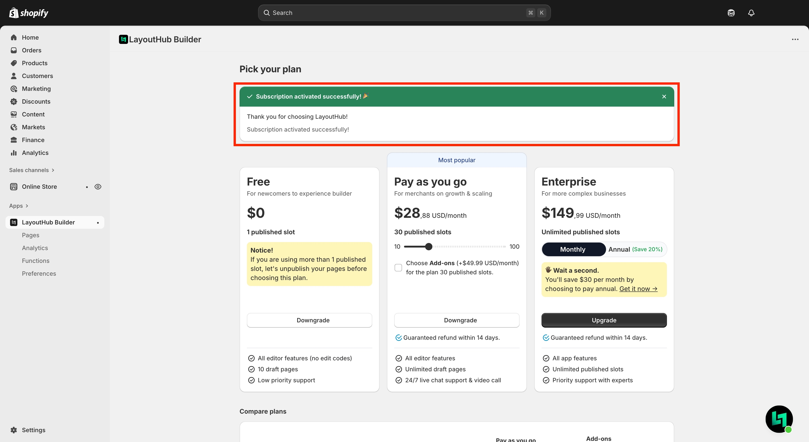

# Change your plan

## Can I upgrade or downgrade my LayoutHub plan?

You can change your Plan to suit your actual usage situation. Just visit LayoutHub's Switch Plan page.

Any changes to your Plan will take effect immediately.


What happens if I downgrade my plan? Please check [this article](../../faq-and-common-issues/faq/what-heppened-if-i-downgrade-my-plan.md).


## Here's how to upgrade or yo downgrade your plan



#### **Access Switch plan page**


Steps:

1. Access LayoutHub app and click **Preference** in the left column.
2. Click **Plan information.**
3. Click **Switch Plan**.


<figure><figcaption></figcaption></figure>


On the **Plan Information** page you will see your **current plan.**\
In this case is PayG 10-slot = Pay as you go 10-slots.




#### **Choose the plan you want to upgrade or downgrade**

After step 1, you will redirect to Switch plan page. Pick the plan you want to upgrade or downgrade to.

Pick the plan you want then click **Upgrade** to upgrade your plan or **Downgrade** to downgrade your plan.

<figure><figcaption></figcaption></figure>



#### **Plan confirmation**

After step 2, you will be redirect to **Plan confirmation page.**

You can choose to add the Add-on package or not then select **Confirm detail.**

<figure><figcaption></figcaption></figure>

After **Confirm detail** you can **enter the discount code** and select **Start plan**.

<figure><figcaption></figcaption></figure>



#### **Approve subscription**

After clicking start plan, Shopify system will take you to **Approve subscription page**.

Select **Approve** to confirm Plan activation and payment.

<figure><figcaption></figcaption></figure>



#### **Change plan successfully**

After your plan activation and payment are confirmed, you will be redirected to the LayoutHub Switch Plan page, where you’ll see the message: “Subscription activated successfully! 🎉”.

<figure><figcaption></figcaption></figure>



## Here's how to cancel your plan


Steps:

1. Access LayoutHub app and click **Preference** in the left column.
2. Click Danger zone.
3. Click Cancel plan.


<figure><figcaption></figcaption></figure>

## What happens if I cancel my pan?

You will be required to **unpublish pages and sections** before cancelling the plan.

Click **Manages page** to unpublish pages and sections.

<figure><figcaption></figcaption></figure>


Don't know how to unpublish pages and sections, check [this article](../../page-and-section-management/publish-and-unpublish.md).


## Frequently Asked Questions

### 1. What is a publish slot?

Publish slots are the number of templates and sections that you can create with LayoutHub and publish to your theme or live page.

### 2. I have many products, collections. Do they consume my publish slots?

Don't worry, a collection or product template can be assigned to all or many different products or collections.&#x20;

For example: if your store has 10 collections, you just need to create 1 collection template and assign it to those 10 collections. All will be counted as 1 publish slot.

#### **3. What happens if I downgrade to a free plan?**

Free plan has only 1 publish slot so the system will ask you to unpublish pages to draft page and leave only 1 published page.
