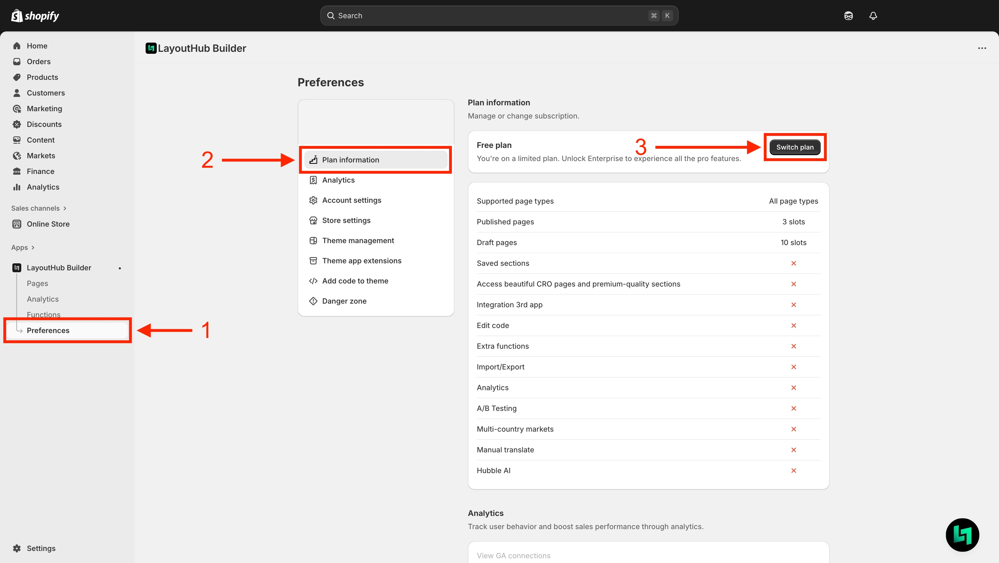
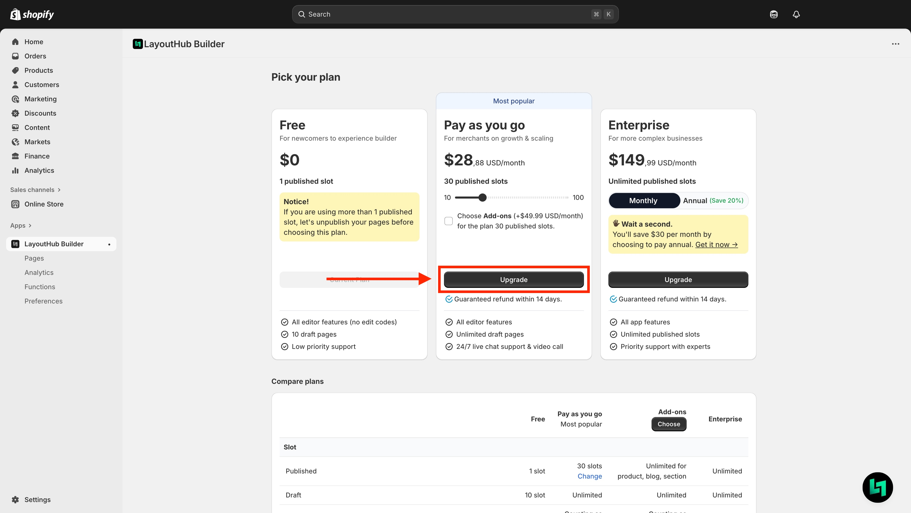

# Plan\&Pricing

## LayoutHub Pricing and Plan

LayoutHub provides flexible monthly subscription plans.

Each offering a unique set of features tailored to different types of users.

* **Free plan**: for newcomers to experience builder
* **Pay as you go plan**: for merchants on growth & scaling
* **Enterprise plan**: for more complex businesses

<figure><figcaption></figcaption></figure>

LayoutHub plans are monthly subscription-based or yearly subscription-based. If you choose to pay monthly, you will be billed for the app subscription as part of Shopify's 30-day subscription billing cycle.

## Pricing plan details

| Header 1        | Header 2  | Header 3      | Header 4  | Header 5   |
| --------------- | --------- | ------------- | --------- | ---------- |
| Cell 1-1        | Free      | Pay as you go | Add-ons   | Enterprise |
| Slot            | Cell 2-2  | Cell 2-3      | Cell 2-4  | Cell 2-5   |
| Cell 3-1        | Cell 3-2  | Cell 3-3      | Cell 3-4  | Cell 3-5   |
| Cell 4-1        | Cell 4-2  | Cell 4-3      | Cell 4-4  | Cell 4-5   |
| Cell 5-1        | Cell 5-2  | Cell 5-3      | Cell 5-4  | Cell 5-5   |
| Business growth |           |               |           |            |
| Cell 7-1        | Cell 7-2  | Cell 7-3      | Cell 7-4  | Cell 7-5   |
| Cell 8-1        | Cell 8-2  | Cell 8-3      | Cell 8-4  | Cell 8-5   |
| Cell 9-1        | Cell 9-2  | Cell 9-3      | Cell 9-4  | Cell 9-5   |
| Templates       | Cell 10-2 | Cell 10-3     | Cell 10-4 | Cell 10-5  |
| Cell 11-1       | Cell 11-2 | Cell 11-3     | Cell 11-4 | Cell 11-5  |
| Cell 12-1       | Cell 12-2 | Cell 12-3     | Cell 12-4 | Cell 12-5  |
| Cell 13-1       | Cell 13-2 | Cell 13-3     | Cell 13-4 | Cell 13-5  |
| Cell 14-1       | Cell 14-2 | Cell 14-3     | Cell 14-4 | Cell 14-5  |
| Page types      | Cell 15-2 | Cell 15-3     | Cell 15-4 | Cell 15-5  |
| Cell 16-1       | Cell 16-2 | Cell 16-3     | Cell 16-4 | Cell 16-5  |
| Cell 17-1       | Cell 17-2 | Cell 17-3     | Cell 17-4 | Cell 17-5  |
| Cell 18-1       | Cell 18-2 | Cell 18-3     | Cell 18-4 | Cell 18-5  |
| Support         | Cell 19-2 | Cell 19-3     | Cell 19-4 | Cell 19-5  |

## Choose a plan



**To select LayoutHub Plan, go to Preferences > Plan information > Switch plan**

<figure><figcaption></figcaption></figure>



**Pick a plan you want and Upgrade**&#x20;

<figure><figcaption></figcaption></figure>



**Plan confirmation**

After clicking **Upgrade**, the system will take you to the **Plan confirmation page**

You can choose to add the Add-on package or not then click **Confirm detail**

<figure><figcaption></figcaption></figure>

After **Confirm detail** you can **enter the discount code** and select **Start plan**.

<figure><figcaption></figcaption></figure>




Need advice on selecting a plan or want to get discount code?&#x20;

Feel free to reach us via **live chat** or at **support@layouthub.com**


