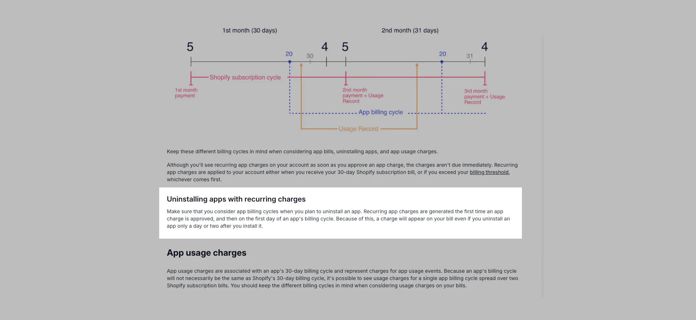

# Refund policy

## When can I get a refund?

To make sure that you will satisfy 100% with LayoutHub app, if you are not ready with the purchase yet, we have a **14-Day Money-Back Guarantee.** That mean you can request a refund within **14 days of first activating your paid plan** for any reason.

**For example**: You upgrade to a paid plan on June 15, 2025 and request a refund on June 20, 2025 (still within 14 days). In this case you are fully eligible to request a refund.

## Who will charge me if I sign up for a paid plan?

Shopify manages the app’s payment, and they will charge users when users activate a paid plan of all third party apps. You can prefer more in [Shopify Help Center.](https://help.shopify.com/en/manual/your-account/manage-billing/your-invoice/apps)

## What happens to my pages if I request a refund?

Requesting a refund from LayoutHub also means that you will cease using LayoutHub paid plans.

* If you decide to downgrade from a higher plan to a lower plan (e.g. PayG-30 to PayG-10 or Enterprise to PayG-10) or downgrade to the Free plan, please check [this article](change-your-plan.md).
* If you decide to cancel your plan, please check [this article](change-your-plan.md#what-happens-if-i-cancel-my-pan).

## What do I need to prepare to request a refund?

You will need to **provide a payment confirmation invoice from Shopify**. Please export **the bill containing the LayoutHub payment** and provide it to LayoutHub customer support team for assistance and processing.

We need the Shopify bill for the requested billing cycle of your store. Based on that, we will have more clues about the case and detect the issue better.

### Export your Shopify Bill



**Access Settings from your Shopify Admin.**

<figure><figcaption></figcaption></figure>



**Export your Shopify Bill**


Steps:

1. Click **Billing**.
2. Choosing the **Billing for target period.**
3. **Export your bill.**


<figure><figcaption></figcaption></figure>

<figure><figcaption></figcaption></figure>


The charge had to be completed. The Shopify invoice needs to have **“Paid”** status.

**Your bill must include payment for LayoutHub**. The app section in the bill will show the name of the app: LayoutHub Page Builder




## How to request a refund?

* If you meet all the requirements above, please kindly contact Beae support team via live chat or support email: [**support@layouthub.com**](mailto:support@layouthub.com) and provide all the information for support team. We will process your refund request asap.
* If you haven’t been charged yet (doesn’t have Shopify invoice, the invoice doesn’t have “Paid” status), please kindly contact Shopify team to request for a cancellation on this charge.

## How will I Receive My Refund?

The refund process might take **5 – 7 working days**. When the request has been approved, we will transfer the amount to Shopify payment gateway. After that Shopify will handle the rest, you will receive the amount in a couple of days depending on your bank.

**Hope this instruction will help you understand the refund process better!**

## Frequently Asked Questions 

1. **If I am on a paid plan, what will happen to my current plan if I delete and reinstall the app?**

After deleting the app, you will automatically be downgraded to the **Free plan** by default.

2. **In case I delete the app but still get charged, why does that happen?**

According to Shopify's policy, even if you delete the app shortly after upgrading your plan, you may still be charged as usual. You can see more in [Shopify Help Center](https://help.shopify.com/en/manual/your-account/manage-billing/your-invoice/apps).

<figure><figcaption></figcaption></figure>

**But don't worry! With our Refund Policy, you just need to contact Support and provide your billing details. We will assist you with a 100% refund! 😊**
