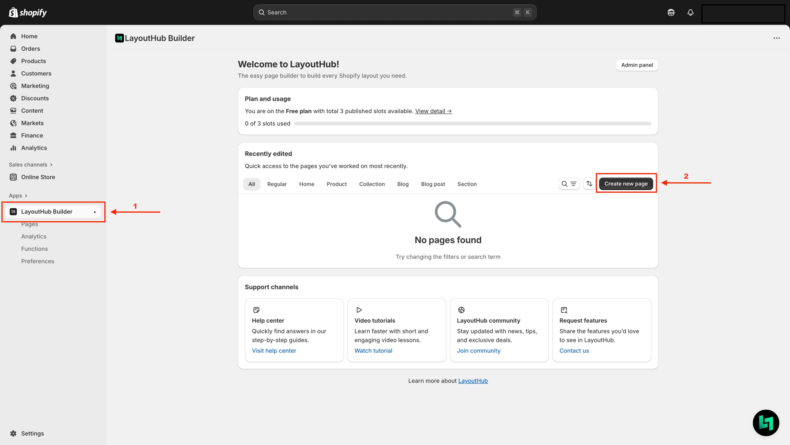
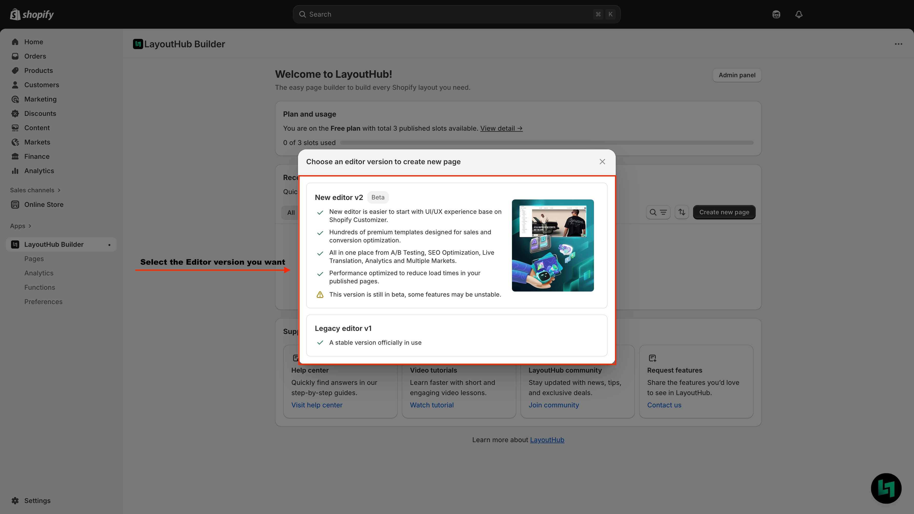
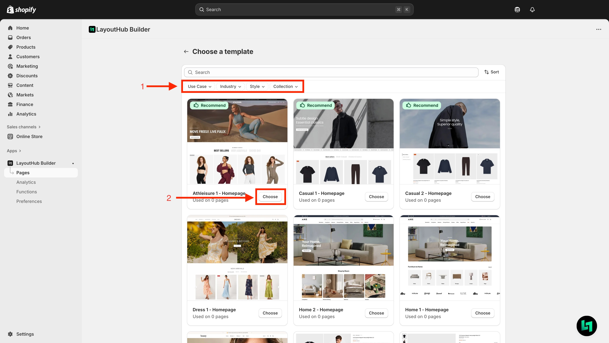
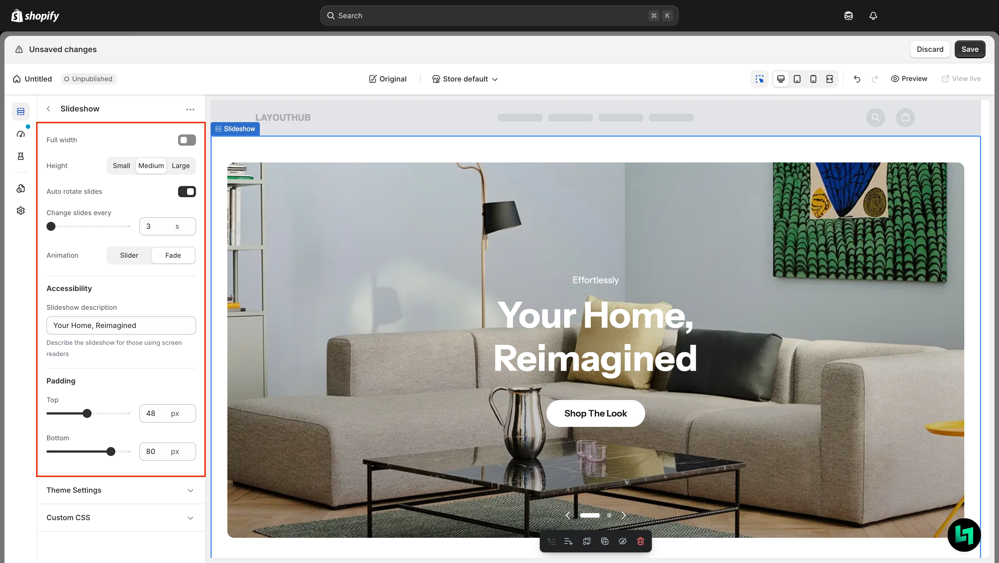
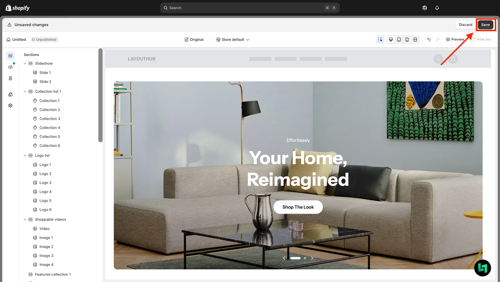
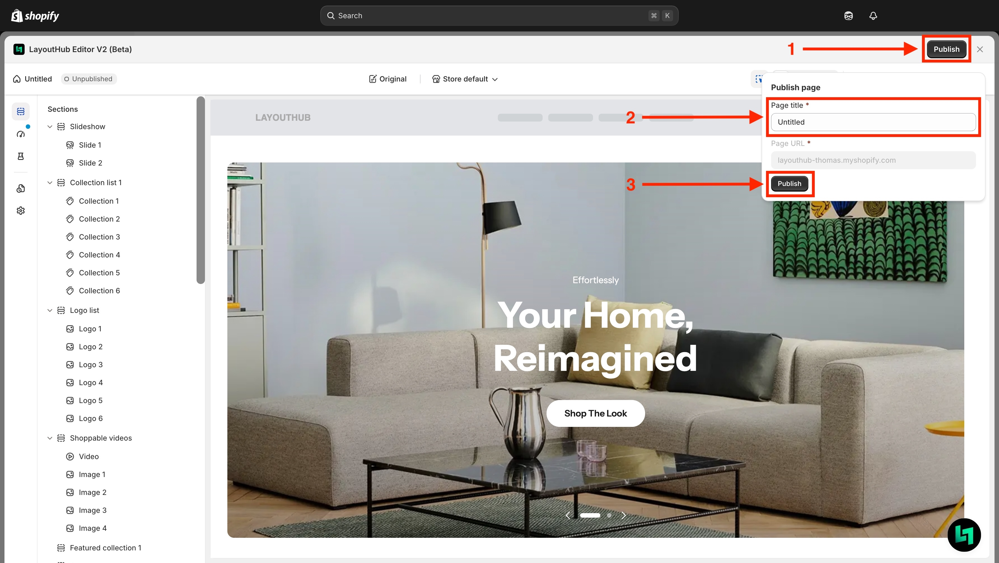

# Quick start guide

## Who is this guide for?

This guide is for anyone who wants to quickly create their first page with LayoutHub.

We’ll walk you through a step-by-step process with our newest Editor - LayoutHub Editor V2, focusing on the essential options so you can build a complete page and publish it in no time.

## Create Your First Page with LayoutHub

With LayoutHub’s template system, building a page is simple — **just pick a template** > **edit** > **publish**. No complicated options required.


LayoutHub templates are continuously updated with the latest trends, designed to meet all e-commerce needs and focused on conversion-driven features to help you boost sales.


## Step by step



#### **Access LayoutHub Dashboard and create your first page**

<figure><figcaption></figcaption></figure>



#### **Choose Your Editor Version**

You can choose between the **Legacy Editor** and **Editor V2**.

<figure><figcaption></figcaption></figure>


&#x20;  Nếu bạn chọn phiên bản Legacy Editor, hãy tham khảo [LayoutHub Legacy Editor Document ](https://docs.layouthub.com/)




#### Pick a template&#x20;

1. Xác định page type mà bạn cần: Homepage; Product page; Collection page, etc.
2. Click "Choose" để sử dụng template

<figure><figcaption></figcaption></figure>


Mỗi page type sẽ có chức năng khác nhau, hãy tham khảo [Page Creation](../../page-and-section-management/page-creation.md) hoặc [LayoutHub Shopify Section](../../page-and-section-management/layouthub-shopify-section.md)




#### Edit

Chỉnh sửa section, block bằng các option đơn giản, logic tương tự Shopify Customizer

<figure><figcaption></figcaption></figure>


Tips: Click vào Section hoặc Block để hiển thị các option của Block hoặc Section đó.&#x20;





#### Save and Publish your page&#x20;

**1. Save your page**&#x20;

<figure><figcaption></figcaption></figure>

**2. Publish**&#x20;

<figure><figcaption></figcaption></figure>




