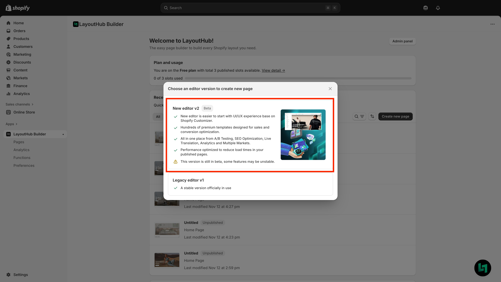
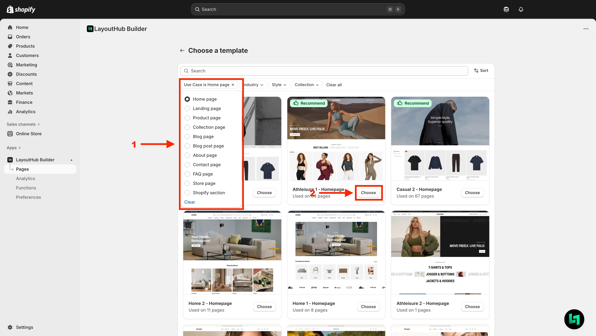
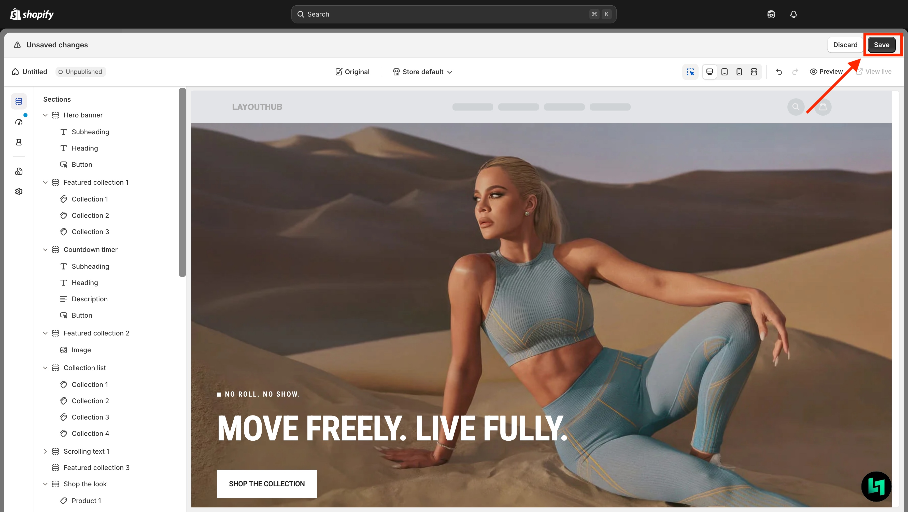
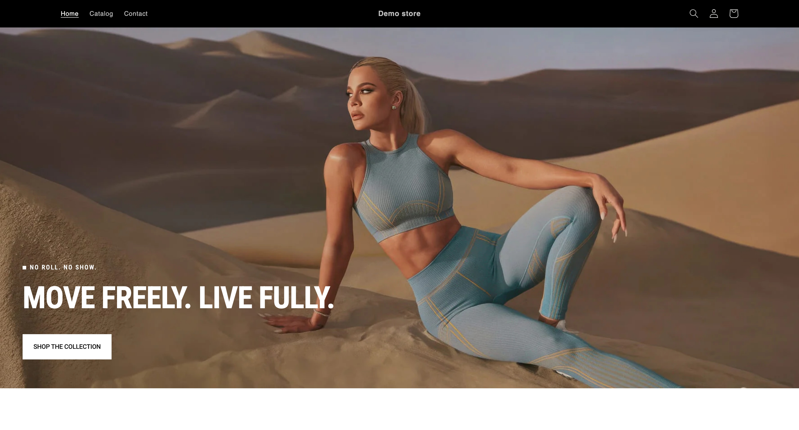

# Quick start guide

## Who is this guide for?

This guide is for anyone who wants to quickly create their first page with LayoutHub.

We’ll walk you through a step-by-step process with our newest Editor - LayoutHub Editor V2, focusing on the essential options so you can build a complete page and publish it in no time.

## Create Your First Page with LayoutHub

With LayoutHub’s template system, building a page is simple — **just pick a template** > **edit** > **publish**. No complicated options required.


LayoutHub templates are continuously updated with the latest trends, designed to meet all e-commerce needs and focused on conversion-driven features to help you boost sales.


## Step by step



**Access LayoutHub Dashboard and create your first page**

<figure><figcaption></figcaption></figure>



**Choose "New Editor V2"**

<figure><figcaption></figcaption></figure>


If you choose the Legacy Editor version, please refer to the [LayoutHub Legacy Editor Document](broken-reference)




**Pick a template**

1. Select the Use case you want
2. Click "Choose" to use the template

<figure><figcaption></figcaption></figure>


Each page type will have different functions, please refer to [Page Creation](../../page-and-section-management/page-creation.md) or [LayoutHub Shopify Section](../../page-and-section-management/layouthub-shopify-section.md)




**Edit sections and blocks using simple options that follow the same logic as the Shopify Customizer.**

<figure><figcaption></figcaption></figure>


**Tip:** Click on any Section or Block to display its corresponding options.




**Save and Publish your page**

**1. Save your page**

<figure><figcaption></figcaption></figure>

**2. Publish**

1. Click **Publish button**
2. Named your template
3. Click **Publish button** again to publish template

<figure><figcaption></figcaption></figure>



### Check your store front

<figure><figcaption></figcaption></figure>



