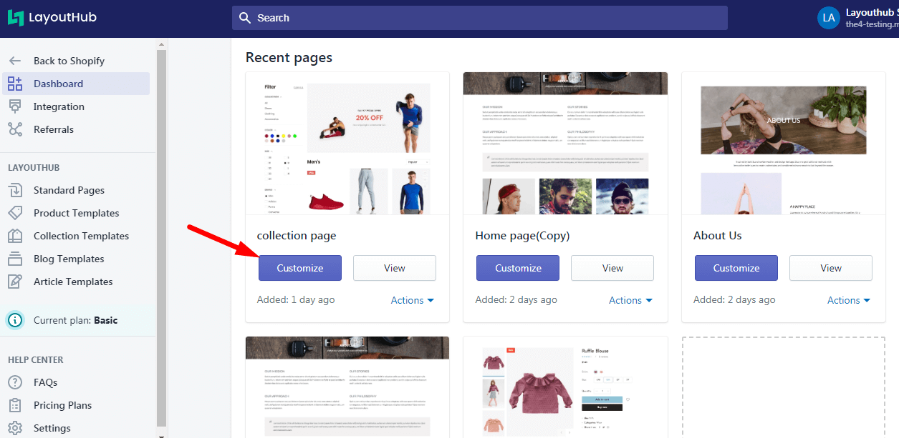

# Layout Management

When you open the App from the Dashboard you can see recent pages. Click **Customize** to go the **Editor.**

## Sidebar widget & Real-time preview

Editor is Customizer, you can adjust all the settings on the left sidebar. It shows a list of sections you can use.

You will see a real-time preview of how that abstract design will render on the right-side. You don’t need to save and click preview to see your new design.&#x20;

.png>)


With the **Live Edit** functionality, the **changes** you make on the sidebar are immediately shown on the Layout without reloading the page.


## Responsive Mode


Our Layout are built and tested for automatically device-responsive, but if you want to make sure how they look on each device.


For more control over how your design looks, > Click the toggle icons   as the device you need to check, to edit its settings. Switch between **Full screen, Desktop, Mobile or Tablet** views by clicking on the corresponding icons on the top of the view port.

* **Mobile screen size**

.png>)

* **Tablet screen size**

.png>)

* **Desktop screen size**

.png>)

## Auto Save

All the changes you make are automatically saved in Editor regardless to loading the page.

_If you love LayoutHub, could you consider posting an review? That would be awesome and_ _really help us to grow our business, here is the_ [_link_](https://apps.shopify.com/layout-hub/reviews)
