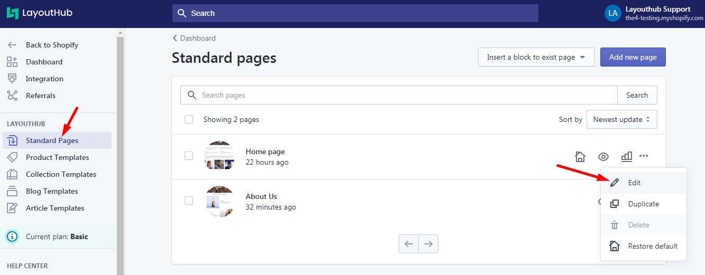

# Edit a Layout

You can edit any of your layouts using this option but first you have to select the page you want to edit. Then click from the Ellipsis button to open an extra menu

From the **list of layouts** that have been customized and achieved at the bottom > **Select a Layout** > Click **Edit**

The App loads your saved design right there. You can continue modifying your Layout. And don't forget to save changes of the new revision by clicking the **Publish page** button at the top right corner.

.png>)

Learn about how to particularly configure a Layout [here](https://docs.layouthub.com/user-guides/featured-elements/homepage)

_If you love LayoutHub, could you consider posting an review? That would be awesome and_ _really help us to grow our business, here is the_ [_link_](https://apps.shopify.com/layout-hub/reviews)
