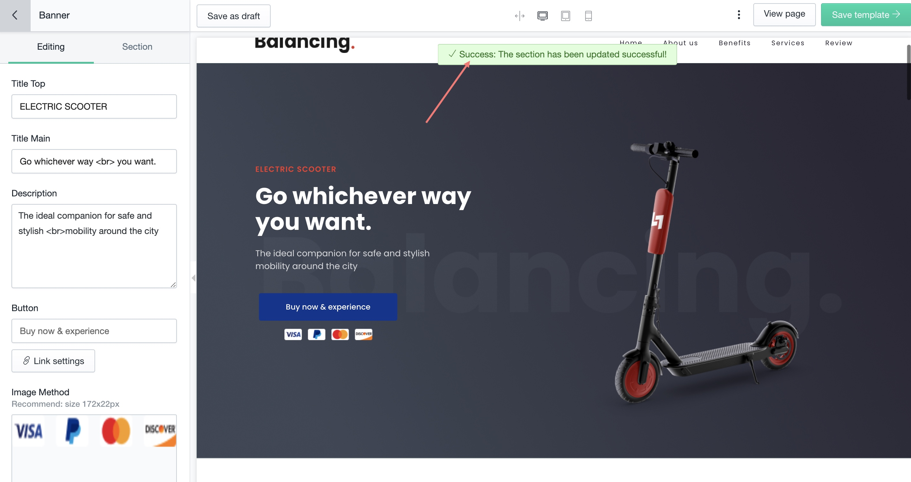

# Edit Section Code

Want even more **customizable**? We provide a convenient ways to edit the files's content of your layout to make advanced changes to the design and behavior of your layout.

Try now with **Section Code Editor**!&#x20;

#### 1 - Go to _**Sections > Choose section**_**&#x20;you wanna config**

#### 2 - At the bottom left corner, click _**Edit section code.**_

.png>)

The code editor shows a directory of section files on the left, and a space to view and edit the files on the right.

.png>)

You can edit your section code to make detailed changes to your layout. Most of the files that make up a layout contain Liquid variants. **Section files** also contain **HTML, CSS, and JavaScript code**. Edit the code for a section only if you have advanced knowledge of  HTML and CSS, JavaScript, and have a basic understanding of Shopify's Liquid.

&#x20;It is possible for you to be the boss of the Layouts since you can completely change it from the root.

#### 3 -  System saves your file automatically

You can customize every section if you are experienced, if not you can use a lot of prebuild sections/layouts in library.


Caution: Once you finish editing, click to save, you can not undo the changes you had made in this code editor&#x20;


_If you love LayoutHub, could you consider posting an review? That would be awesome and_ _really help us to grow our business, here is the_ [_link_](https://apps.shopify.com/layout-hub/reviews)_._
