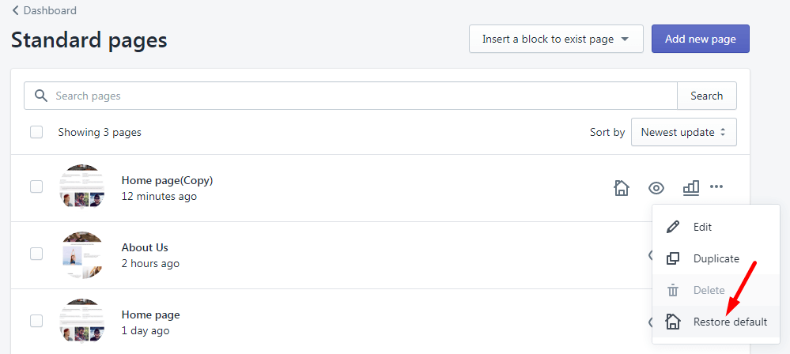
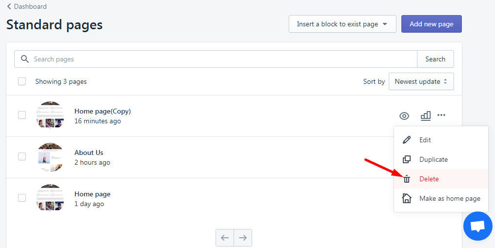

# Delete a Layout

Before deleting a Layout from directory, you must **recover** this Layout first by select **Restore Default** or **Make Default** the other layouts.

<figure><figcaption></figcaption></figure>

Next step, from the **list of layouts** that have been customized and achieved at the bottom > **Select a Layout** > Click **Delete Template.**


Be carefully before you decide to delete a Layout as you can not undo this action


<figure><figcaption></figcaption></figure>

_If you love LayoutHub, could you consider posting an review? That would be awesome and_ _really help us to grow our business, here is the_ [_link_](https://apps.shopify.com/layout-hub/reviews)
