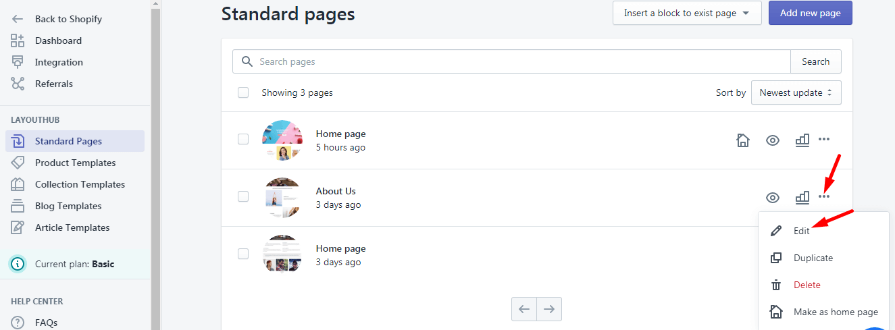
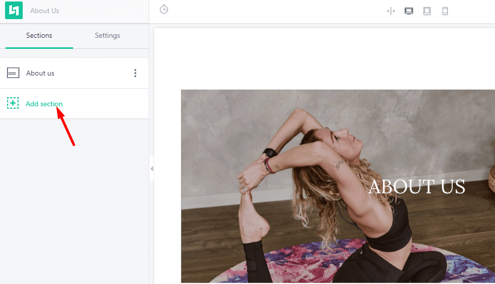
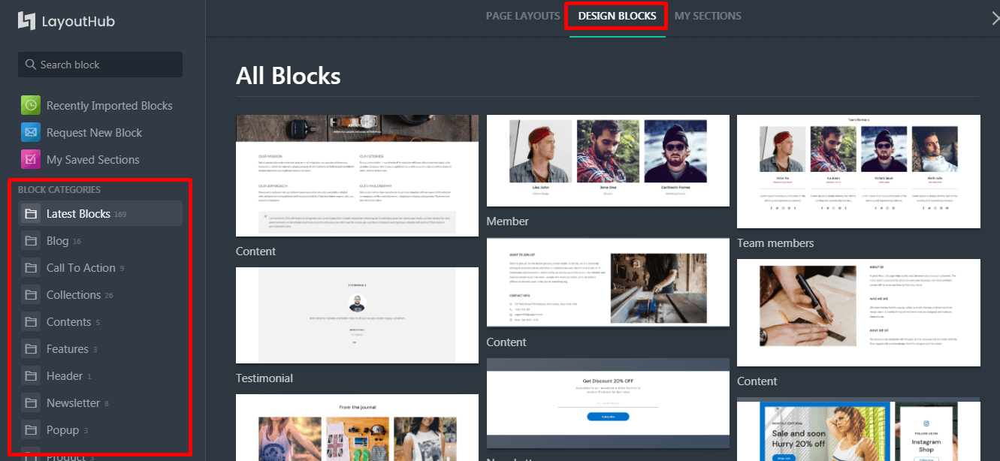
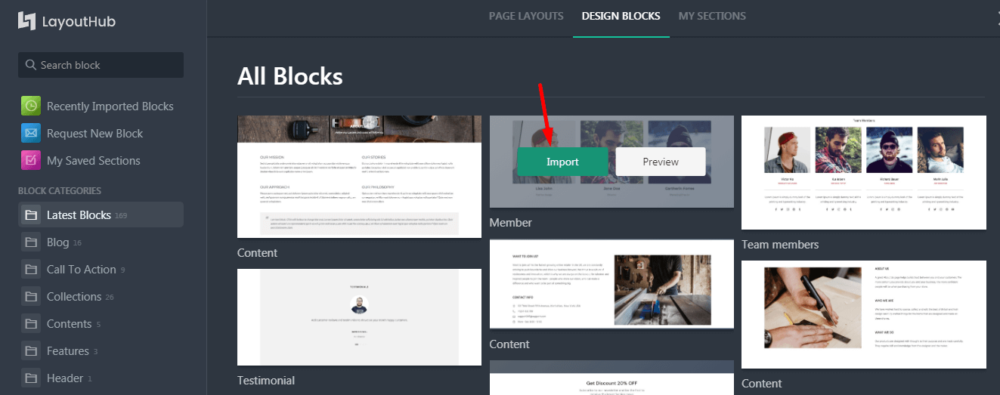
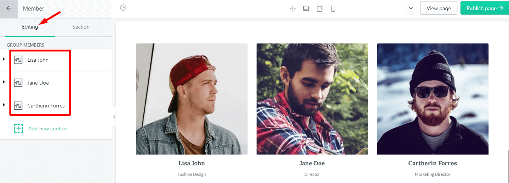
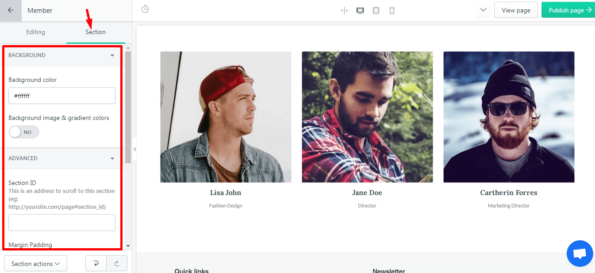
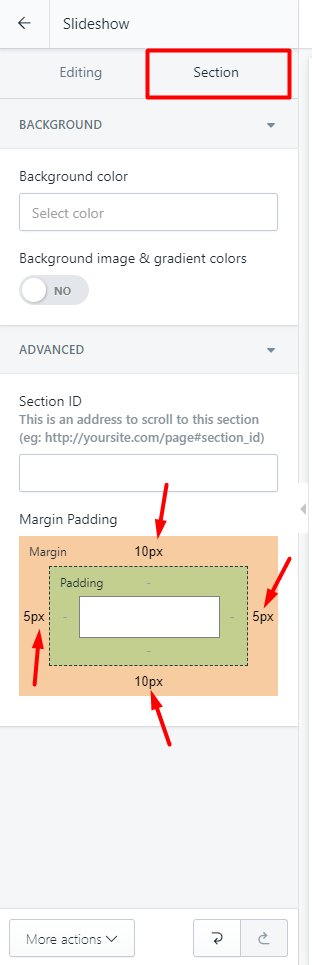
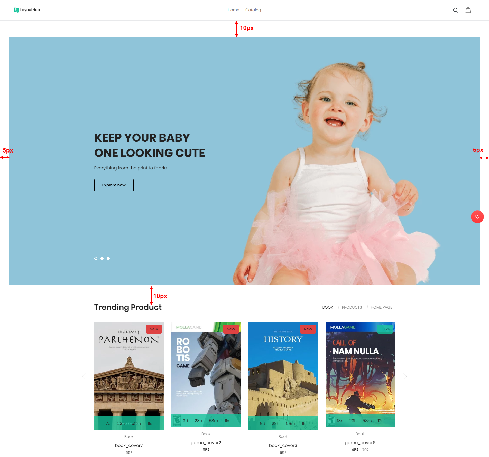
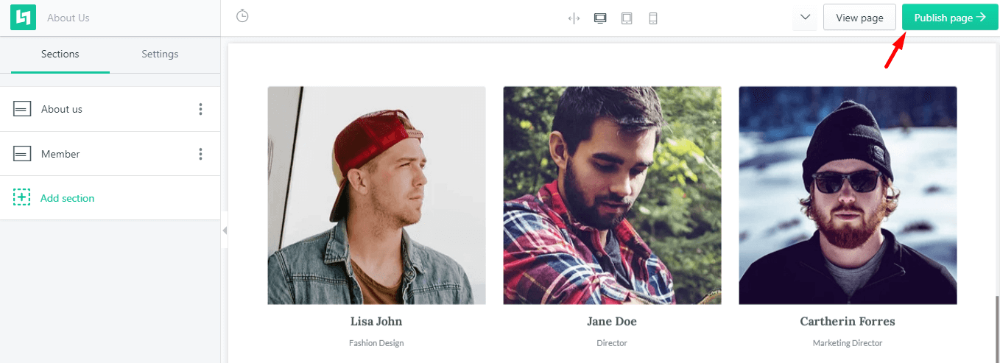
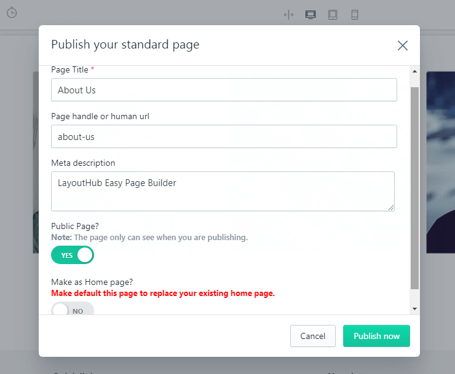

# Design Blocks

## What is a Block (Section)?

Block means section, a certain area with images and texts. There are many **styles of section/blocks**‌. Design Blocks is the element constitute a Layout/Template.

With LayoutHub, you instantly have access to **170+ built-in content blocks** available out of the library. Each of content block has been carefully crafted by web design professionals and offers multiple options which are enough to build any layout you can think of. Literally, within minutes you can build complex layouts on the basis of our content elements and without touching a single line of code. And if you think that it’s not enough you should try now [here](https://app.layouthub.com/editor?page=index).

All you have to do is just select values, check boxes, drag and drop and you are ready to launch your shiny Shopify website.

Block example:

* _**Collection banner block**_

* _**Instagram Feed block**_

* _**Product Grid block**_

## How to import a Block?


If you don't want to use our available fully-made Layout samples, you can add one by one section to mix and match an unique layout.


Step 1: Select a **Page > Click Customize.** I suppose I would like to design for my About page using pre-built blocks from our library‌.

Step 2: Click **Add section**

Our App have many types of Block(Section) that you can choose from categories widget.

Step 3: Click **Import** button to import blocks.

## **How to configure a Block?**

**Layout Hub** gives you two different tabs to edit individual texts and images. While the specific options that you’ll see in each tab depend on the exact texts, images that you’re editing, the general division of options is the same no matter what:



**Editing:** to change texts, images, colors.






**Section:** to change entirely the background, section ID, margin and padding of the section.




## Adjust space between blocks

Every single one of Block has a **Section tab** to adjust the space and gaps between sections. Directly type a number of pixel (negative number acepted) to the corresponding **Margin values** here as the size of the gaps.

**Result:**

## How to publish a customized blocks?

Finally, after you had completed customizing your Layout, you can click **Publish Page** button.

Enter a **Page Title, Page handle, Meta description** for this customized Layout and press **Publish now**.

* **Page Title:** Enter your page title. This title will display as a link in search engine results. You can enter up to 55 characters in the title.
* **Page handle or human url:** Enter your url, the URL can't contain any spaces.
* **Meta description:** Enter a description for the search engine listing. You can enter up to 320 characters in the description.
* **Publish page:** When you choose YES on this mode, your page will be publishing, that mean everyone can see your page if they have the link. If NO here the Design is **created and achieved** in the **App Dashboard**, you can go there to re-use or edit the layout for the next time.
* **Make as Home page:** Choose YES if you want to make default this page to replace your existing home page.
* **"Publish now"** **button:** Click on this button to publish or Save your page.

_If you love LayoutHub, could you consider posting an review? That would be awesome and_ _really help us to grow our business, here is the_ [_link_](https://apps.shopify.com/layout-hub/reviews)
