# Create Layouts

## What is a Page Layout?

Page Layout is a **template** that includes pre-built elements such as sections, blocks, texts, images, sliders,... etc. They are combined to each other to construct a spectacular structure in various styles.

We offer **5 types** of **Page template**. They are **Standard, Product, Collection, Blog** and **Article pages.**

Moreover, every Page Layout showcased will have high-quality **free stock images** as placeholders. Our design team has crafted each and every piece of an individual template to ensure it is unique and **easily modified** to adapt to your unique needs.

With LayoutHub, you don’t have to be a developer to create a page. With LayoutHub you don’t have to be designer either.

**Amazing features** included in a Page Layout:

* Section element to combine several rows
* Color Picker
* Text Translation
* Extended CSS box
* Options to save section and row as templates
* Remove at one click without loading process

## How to create/import a Page Layout from Layout Hub

**Step 1:** From the menu on the left side, Select **Standard** **Page >** Click **Add new page.** I suppose I would like to design for my **Homepage.** (You can also design for the other pages such as Product page, Collection page, Blog page,... etc)

<figure>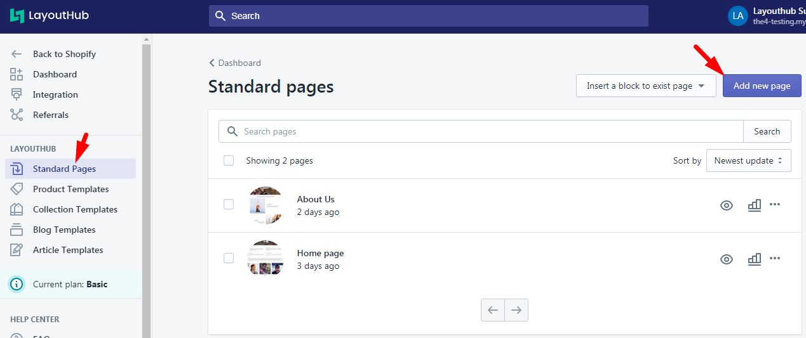<figcaption></figcaption></figure>

**Step 2:** Choose **show** or **hide** Header and Footer.

.png>)

**Step 3:** Select **Blank layout**

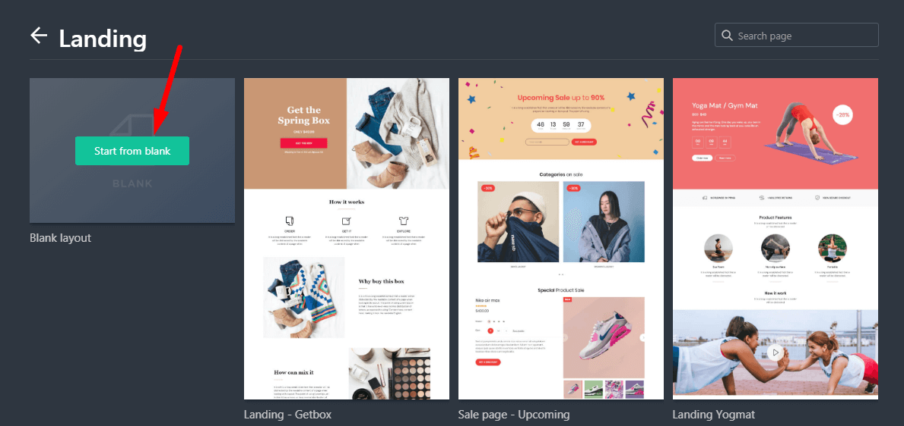

**Step 4:** Click **Add layout**

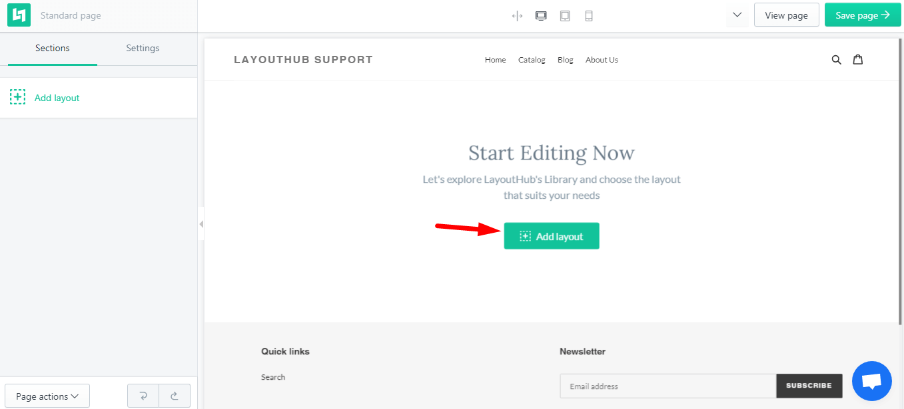

**Step 5:** Select a **layout** from our library for your home page.

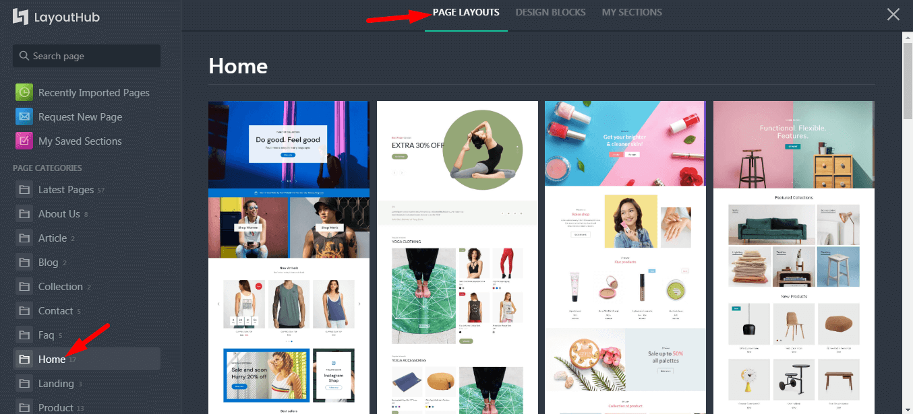

You can also add a **design block** to your page.

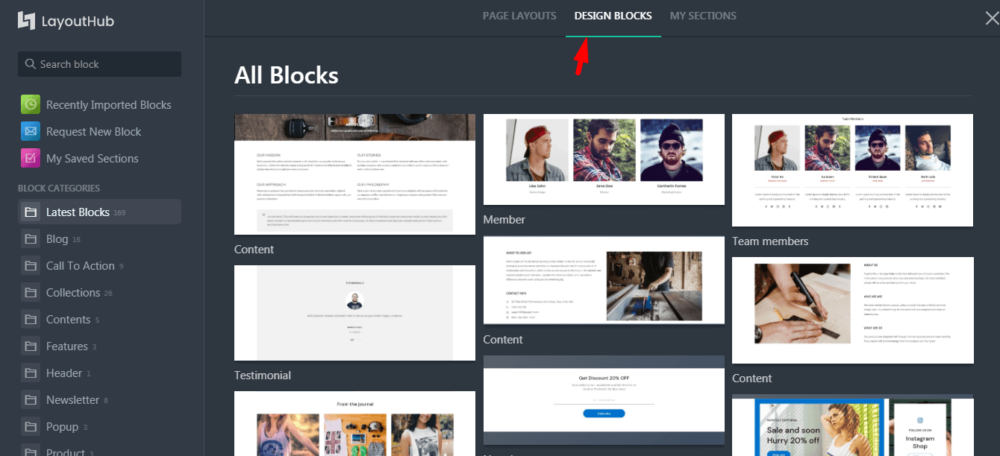

Click **Import/Preview** button to import design to your store.

Searching for your designs quickly by **Search form** or the **Categories Menu** on the left side.

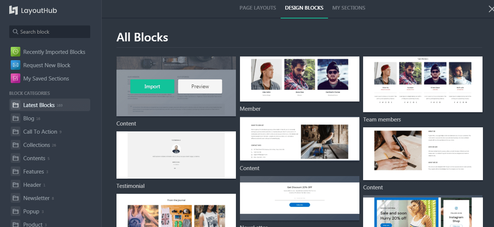

Select any **Layouts** and click **Install button.** Then you start customizing the Layout as you desire

## How to configure a Page layout

Now you get the Homepage Layout sample imported to your store.


Only the body of Homepage imported. The Header and Footer section are **fixed and initial** from your current theme.


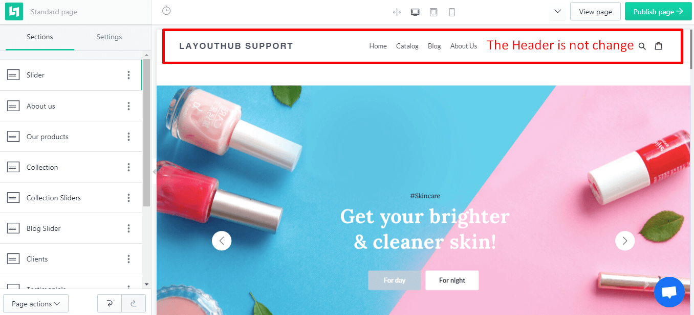

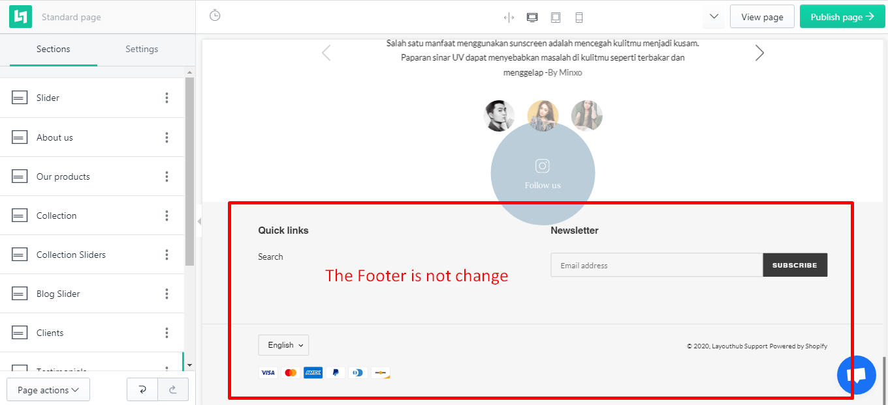

LayoutHub offers all the controls you need to work with content elements – change, edit, duplicate, remove, preview or create presets for your elements whenever you wish with just single click.Configure your Shopify site layout like never before.

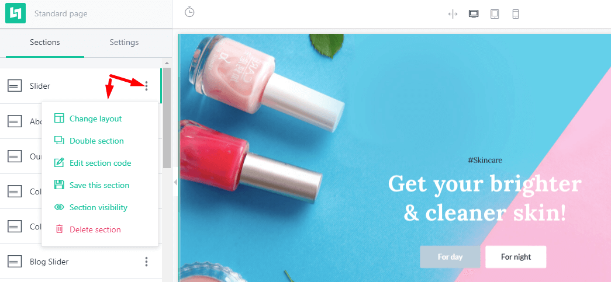

On this content of the Layout, you can changed everything by using the **sidebar Editor.** But It’s just a preview. You can customize this preview like customizing a **Shopify Theme**, they are very simple and user-friendly.

There are 2 tabs that you can switch over them to make changes: **Sections** + **Settings**

**Layout Hub** gives you 2 different tabs to edit individual sections/blocks. While the specific options that you’ll see in each tab depend on the exact section/block that you’re editing.

* **Section**: include settings of each blocks: Slide block, Collection block,...

* **Settings**: Include settings of global, apply a color or gap at once time onto all the pages. All websites are different! Use **Primary color** to make a perfect match with your corporate and brand identity. You can change visual appearance literally in seconds and determine which color, font you want to affect – combine your design with your brand as a unique design.

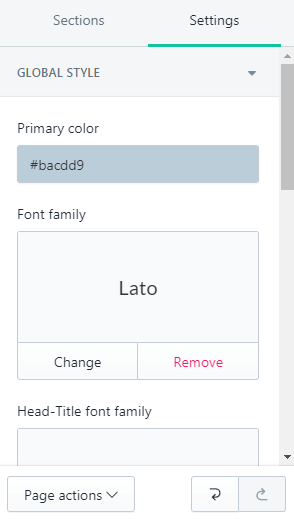

#### \*Adding Custom CSS

If you’re a casual user, you might not ever need to use custom CSS in your page builder designs. But for more advanced users, the ability to add custom CSS is a great way to get more control over your page layouts.

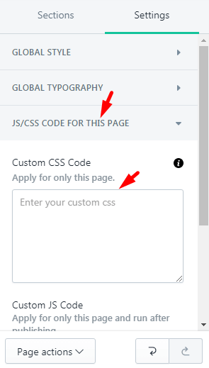

## How to publish your customized Layout

Finally, after you had completed customizing your Layout, you can click **Publish Page** button.

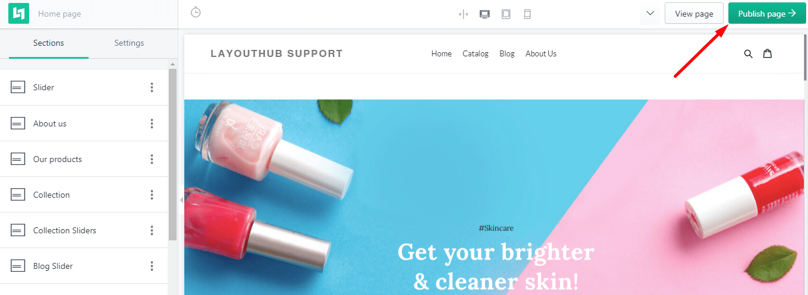

Enter a **Page Title, Page handle, Meta description** for this customized Layout and press Publish now.

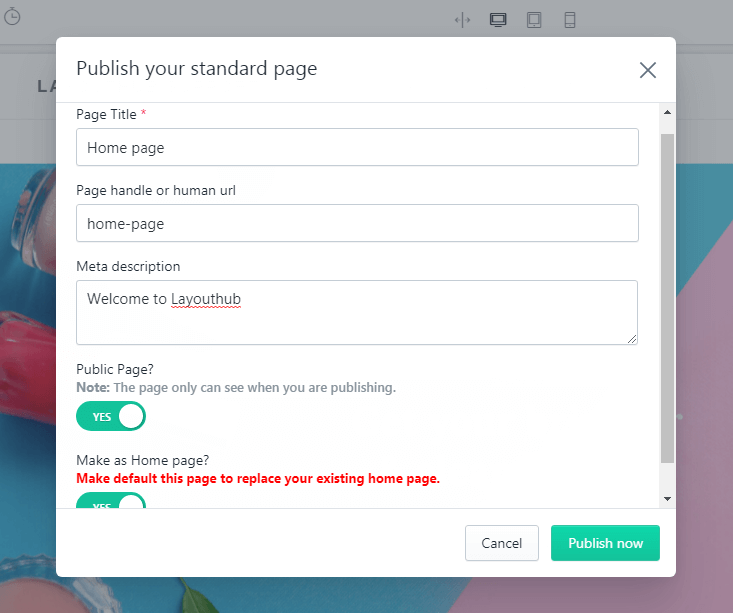

* **Page Title:** Enter your page title. This title will display as a link in search engine results. You can enter up to 55 characters in the title.
* **Page handle or human url:** Enter your url, the URL can't contain any spaces.
* **Meta description:** Enter a description for the search engine listing. You can enter up to 320 characters in the description.
* **Publish page:** When you choose YES on this mode, your page will be publishing, that mean everyone can see your page if they have the link. If NO here the Design is **created and achieved** in the **App Dashboard**, you can go there to re-use or edit the layout for the next time.
* **Make as Home page:** Choose YES if you want to make default this page to replace your existing home page.
* **"Publish now"** **button:** Click on this button to publish or Save your page.

_**Result:**_ Please go to **your store front**- **Landing page**, it's replaced by the new layout

## **How to revert changes after clicked Publish button?**


In the case you want to revert all the changes, back to your Original design


Go back to Layout Hub **dashboard** > Select exactly the **Shopify Default template** not the other customized layouts > Click **Restore default template** button.

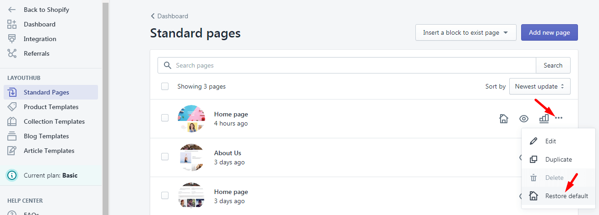

_If you love LayoutHub, could you consider posting an review? That would be awesome and_ _really help us to grow our business, here is the_ [_link_](https://apps.shopify.com/layout-hub/reviews)
